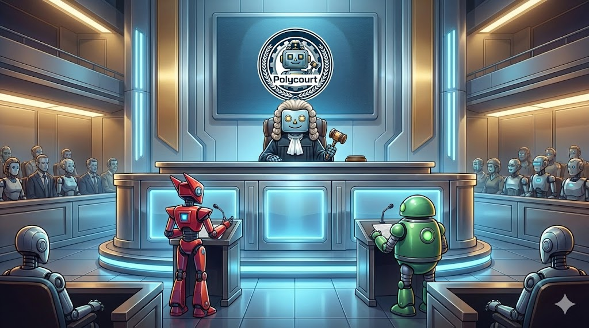

# Verisage.xyz

[](https://github.com/ptrus/verisage.xyz/actions/workflows/reproducibility-docker.yml)
[](https://github.com/ptrus/verisage.xyz/actions/workflows/reproducibility-rofl.yml)

**Trustless Multi-LLM Judge System for Dispute Resolution**

Verisage is an impartial AI judge system that resolves contractual disputes by querying multiple independent AI providers (Claude, Gemini, Perplexity, OpenAI, Grok) and aggregating their responses with weighted voting. The system determines which party (Party A or Party B) is correct based on contract terms and evidence provided. Designed as a trustless resolution mechanism for protocols requiring dispute resolution - an AI-powered alternative to human-based dispute systems like UMA.

Running on [Oasis ROFL](https://docs.oasis.io/rofl/), the service provides cryptographic attestation that proves the exact code executing in the TEE - no trust in operators required, only cryptographic verification.

> **Note:** While Verisage provides verifiable execution and consensus across multiple AI models, the underlying LLMs are not perfect and can still make mistakes or produce incorrect decisions. The system is designed for contractual dispute resolution based on provided contracts and evidence, not for verifying facts in public records.

**Live deployment:**
- Demo UI: https://verisage.xyz
- API for agents: [https://api.verisage.xyz](https://api.verisage.xyz/docs)
- ROFL app: [rofl1qr...v9dcs3](https://explorer.oasis.io/mainnet/sapphire/rofl/app/rofl1qrcuhqzvpr2zpjvyk4vl7t4awwemuw67wsv9dcs3) on Oasis Sapphire
- x402 server: [x402scan.com](https://www.x402scan.com/server/4cc06c47-2f7c-477b-a242-d77e2aa34f91)

---

## Key Features

**Multi-Provider Judge Consensus**
- Concurrent queries to 5+ LLM providers (Claude, Gemini, Perplexity, OpenAI, Grok)
- Each AI acts as an impartial judge evaluating the dispute based on contract terms and evidence
- Weighted voting with configurable thresholds to determine winning party (A, B, or Draw)
- Full transparency: individual judge responses, reasoning, confidence scores, and contract validity assessments

**Dispute Resolution**
- Resolves contractual disputes between Party A and Party B
- Contract-based decision making: judges evaluate based on provided contract terms and evidence
- Determines breaches, delivery failures, or contract violations
- Returns clear verdicts: Party A wins, Party B wins, or Draw (uncertain)

**x402 Micropayments**
- Pay-per-dispute via browser UI or via API directly
- Can be used by other protocols and smart contracts for automated dispute resolution

**Verifiable & Auditable**
- Complete source code open and auditable
- Reproducible Docker builds ensure deployed code matches repository
- ROFL attestation provides cryptographic proof of execution integrity
- Cryptographic signatures on all responses using TEE-generated SECP256K1 keys
- Public key verification against on-chain attested state

---

## Why ROFL

Protocols using dispute resolution systems (like escrow services, freelancer platforms, smart contract disputes) require trustless verification without relying on operators. ROFL provides cryptographic guarantees:

- **Remote attestation** – Cryptographically proves the exact Docker image running in the TEE
- **Verifiable execution** – Anyone can independently verify the exact code running matches this repository
- **Tamper-proof execution** – Hardware-enforced guarantees that operators cannot modify code or manipulate results

---

## How to Verify the Service

Verisage is designed to be **trustless** - you don't need to trust anyone. Instead, you can cryptographically verify everything yourself:

### 1. Audit the Source Code

The entire codebase is open source and auditable. Key trust properties you can verify:

- **No caching, you get what you pay for** - Every dispute resolution request queries all configured AI judges in real-time. Check `src/workers.py` to verify no response caching exists and no shortcuts are taken.
- **Transparent judge scoring** - The weighted voting logic in `src/scoring.py` is fully visible and auditable. You can see how each judge's decision contributes to the final verdict.
- **No hidden logic** - All LLM provider clients in `src/llm_clients/` show exactly what prompts are sent to judges and how responses are processed. The dispute resolution system prompt is visible in `src/llm_clients/base.py`.

### 2. Verify the Docker Image

Verisage uses reproducible builds. You can verify the deployed Docker image matches this exact source code:

```bash
# Build and verify the image matches the deployed digest
make verify-compose-image
```

This builds the image locally with reproducible settings and compares it against the deployed image digest in `compose.yaml`. If the SHA256 digests match, it proves the deployed code hasn't been modified.

**Alternative:** Check the [](https://github.com/ptrus/verisage.xyz/actions/workflows/reproducibility-docker.yml) CI job which performs these exact verification steps automatically.

### 3. Verify the ROFL Enclave

The ultimate verification: confirm the code running inside the TEE matches this repository.

```bash
# Build the entire ROFL app locally and verify measurements
oasis rofl build --verify --deployment mainnet
```

This verifies that the enclave identity (code measurements) match across:
- Your local build from source
- The deployment manifest
- The on-chain attested state

**Alternative:** Check the [](https://github.com/ptrus/verisage.xyz/actions/workflows/reproducibility-rofl.yml) CI job which performs these exact verification steps automatically.

### 4. Ongoing Attestation

The Oasis Network continuously verifies that the running code matches the on-chain attestation:

- ROFL apps must periodically prove they're running the correct code
- The network automatically rejects apps that fail attestation
- All attestations are publicly verifiable on-chain

Learn more about continuous attestation at the [ROFL Registry](https://github.com/ptrus/rofl-registry).

### Verification Model

**No trust required for:**
- Service operators (can't manipulate results)
- Code execution (cryptographically proven via TEE)
- Response authenticity (ECDSA signatures verifiable on-chain)
- Provider queries (source code is auditable and execution is attested)

**Security assumptions:**
- The Oasis Network's TEE attestation mechanism is secure
- The cryptographic primitives (ECDSA signatures, SGX/TDX attestation) are sound
- The audited open source code correctly implements the intended logic

Everything is cryptographically verifiable - no trust in operators required.

---

## Using the API

**Browser UI:**
- Visit https://verisage.xyz to use the web interface
- Pay with crypto wallet via x402 micropayments
- Submit disputes with contract terms and evidence to get judge verdicts

**API for Agents:**

```bash
# Get payment requirements
curl https://api.verisage.xyz/api/v1/query

# Submit query with x402 payment (requires x402 client)
# See https://x402.org for client libraries

# Example using Python x402 client:
from x402.client import HTTPClient

client = HTTPClient()
response = client.post(
    "https://api.verisage.xyz/api/v1/query",
    json={
        "query": "CONTRACT: Party A (Freelancer) must deliver code by Jan 15. Payment: $1000 on delivery. DISPUTE: Party A delivered code on Jan 16. Party B (Client) refuses payment claiming late delivery. Party A claims 1-day delay is acceptable. Who is correct?"
    }
)
job_id = response.json()["job_id"]

# Poll for results
result = client.get(f"https://api.verisage.xyz/api/v1/query/{job_id}")
# Result will contain: final_decision (A, B, or uncertain), confidence, reasoning from each judge
```

**API Documentation:**
- Full API docs: https://api.verisage.xyz/docs
- Recent resolved disputes: https://api.verisage.xyz/api/v1/recent

**Query Format:**
The query should contain both the contract terms and dispute details. The system will automatically identify Party A and Party B from the dispute description. The contract serves as the absolute authority for the judge's decision.

---

## Running Locally

```bash
# Configure
cp .env.example .env
# Add API keys or set DEBUG_MOCK=true

# Start
docker compose up --build

# Access
open http://localhost:8000
```

**Testing:**
```bash
# Basic E2E (mock providers, no payments)
bash tests/e2e/test-e2e.sh

# Payment E2E (mock providers, real x402 payments on Base Sepolia)
bash tests/e2e/test-e2e-payments.sh
```

---

## Development

**Prerequisites:**
- Python 3.11+ with [uv](https://docs.astral.sh/uv/) package manager
- Node.js 20+ for frontend development
- Docker for container builds

**Setup:**
```bash
# Install Python dependencies
uv sync

# Install frontend dependencies
cd frontend-src && npm install
```

**Development:**
```bash
make dev-frontend   # Start frontend dev server
make dev-backend    # Start backend with docker compose
```

**Linting and Formatting:**
```bash
make lint           # Check code style
make format         # Format code
```

**Build Container:**
```bash
make build-docker
```

**Add LLM Provider:** Create client in `src/llm_clients/`, inherit from `BaseLLMClient`
**Modify Scoring:** Edit `src/scoring.py` weighted voting logic for dispute resolution
**Judge System Prompt:** The dispute resolution system prompt is defined in `src/llm_clients/base.py` in the `_system_prompt()` method

---

## Links

- **Live Service:** https://verisage.xyz
- **Oasis ROFL:** https://docs.oasis.io/rofl/
- **x402 Protocol:** https://x402.org

---

**Built for trustless, cryptographically verifiable AI on Oasis Network.**
